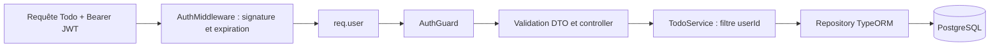
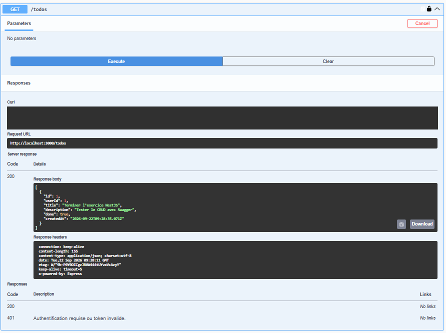
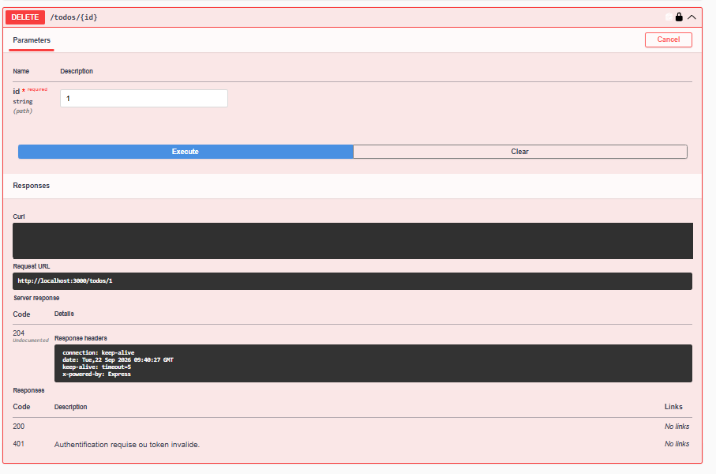

# API Todo — NestJS, PostgreSQL et JWT

Exercice réalisé progressivement à partir de [l’énoncé](Exo-Api-Todo.md), avec une API REST permettant de créer un compte, de se connecter et de gérer ses propres tâches. Swagger sert à documenter et tester les routes dans le navigateur.

## Fonctionnalités

- Inscription avec email unique, rôle `user` et mot de passe haché avec scrypt et un sel aléatoire.
- Connexion avec JWT signé en HS256, valable une heure.
- Middleware de vérification du token et guard sur toutes les routes Todo.
- CRUD PostgreSQL : chaque requête filtre les tâches par propriétaire.
- Validation des DTO ; les champs supplémentaires tels que `userId` ou `role` sont refusés.
- Aucun mot de passe dans les réponses HTTP ni dans les JWT.

## Installation locale — Windows CMD

Prérequis :

- Node.js **24.19.0 ou version ultérieure**.
- npm **11.19.1 ou version ultérieure**.
- PostgreSQL pour démarrer l’API complète (projet testé avec PostgreSQL 18).

Les versions effectivement vérifiées sont Node.js **24.19.0** et npm **11.19.1**. Les versions minimales sont déclarées dans `package.json` (`engines`), et les dépendances sont verrouillées dans `package-lock.json`. Les versions ultérieures ne sont pas toutes testées.

Depuis le dossier du projet :

```cmd
npm ci
copy .env.example .env
```

Créer une base vide depuis psql ou pgAdmin :

```sql
CREATE DATABASE api_todo;
```

Renseigner dans `.env` les paramètres de connexion PostgreSQL. `DB_PASSWORD` est le mot de passe du compte défini par `DB_USERNAME`. Pour créer la clé JWT, lancer cette commande puis copier le résultat dans `SECRET` :

```cmd
node -e "console.log(require('node:crypto').randomBytes(48).toString('hex'))"
```

Démarrer l’application :

```cmd
npm run start:dev
```

- API : http://localhost:3000
- Swagger : http://localhost:3000/api
- Document OpenAPI : http://localhost:3000/api-json

Le port est configurable avec `PORT`. TypeORM crée les tables au démarrage grâce à `synchronize: true`. Ce réglage est réservé à cet exercice local ; une application déployée doit utiliser des migrations.

## Parcours Swagger

1. `POST /auth/register` avec un email et un mot de passe de 12 à 128 caractères.
2. `POST /auth/login` avec les mêmes identifiants.
3. Copier `access_token`, cliquer sur **Authorize** et coller uniquement le token (sans `Bearer` ni guillemets).
4. Créer une tâche avec `POST /todos` :

```json
{
  "title": "Terminer l’exercice NestJS",
  "description": "Tester le CRUD avec Swagger"
}
```

5. Consulter `GET /todos` et `GET /todos/{id}` avec l’identifiant reçu.
6. Modifier la tâche avec `PATCH /todos/{id}` :

```json
{ "done": true }
```

7. Supprimer avec `DELETE /todos/{id}` : réponse **204**, sans contenu. Une nouvelle lecture renvoie **404**.

L’identifiant du propriétaire vient du JWT ; il ne doit jamais être envoyé dans le body. Pour vérifier l’isolation, créer un deuxième compte : sa liste est vide et l’accès à une tâche du premier compte renvoie 404. Un token expiré nécessite une nouvelle connexion.

## Routes

| Méthode | Route | Accès | Résultat principal |
| --- | --- | --- | --- |
| POST | `/auth/register` | Public | 201 ; 400 si données invalides ; 409 si email utilisé |
| POST | `/auth/login` | Public | 200 et JWT ; 401 si identifiants incorrects |
| GET | `/users/:id` | Public dans cet exercice | 200 sans password ; 400 ou 404 |
| POST | `/todos` | JWT | 201 |
| GET | `/todos` | JWT | 200, tâches du propriétaire |
| GET | `/todos/:id` | JWT | 200 ou 404 |
| PATCH | `/todos/:id` | JWT | 200 ou 404 |
| DELETE | `/todos/:id` | JWT | 204 ou 404 |

Les routes Todo renvoient 401 en l’absence d’authentification valide. Les identifiants non entiers et les DTO invalides renvoient 400. Une tâche inexistante ou appartenant à un autre utilisateur renvoie le même 404.

## Organisation et fonctionnement

```text
src/
  auth/       Inscription, connexion, JWT, middleware, guard, décorateur CurrentUser
  users/      Entité User, DTO, service, controller et hachage
  todo/       Entité Todo, DTO et CRUD filtré par propriétaire
  app.module.ts
  main.ts     Validation globale et Swagger
```



`UsersModule` exporte `UsersService` pour `AuthModule`. `TodoModule` importe `AuthModule` pour accéder au service JWT et enregistre le middleware sur `TodoController`. Le guard protège le controller entier.

## Vérifications

Pour reproduire les contrôles depuis un clone propre, sans `.env` ni PostgreSQL :

```cmd
git clone https://github.com/MikeTD24/Exo-Nestjs-ApiTodo.git verification-exo-todo
cd verification-exo-todo
node --version
npm --version
npm ci
```

Puis exécuter :

```cmd
npm run typecheck
npm run lint
npm test
npm run test:auth
```

- `typecheck` vérifie TypeScript sans modifier `dist`, ce qui évite les conflits avec le serveur en surveillance.
- `npm test` vérifie le hachage et le sel aléatoire.
- `test:auth` compile dans `.test-dist`, puis teste par HTTP l’inscription, la connexion, les tokens invalides/expirés, le CRUD, les données interdites et l’isolation entre utilisateurs. Le repository est en mémoire : ces tests ne modifient pas PostgreSQL.
- Le parcours Swagger a également été testé manuellement sur PostgreSQL : création, modification, lecture, suppression et lecture après suppression.
- `npm run test:e2e` est le test de démarrage historique ; il charge `AppModule` et nécessite la configuration `.env` et PostgreSQL.

Pour compiler les fichiers de production, arrêter le serveur en surveillance avant `npm run build`, puis lancer `npm run start:prod`.

## Captures du parcours

Captures historiques des tests sur PostgreSQL. Le bloc Curl contenant l’autorisation a été masqué par un rectangle opaque ; les autres pixels sont inchangés.

### Liste des tâches — HTTP 200



### Suppression — HTTP 204



Cette capture précède l’ajout des descriptions Swagger : le libellé historique « Undocumented » a depuis été corrigé dans le code.

## Périmètre pédagogique

Le projet couvre l’énoncé et ses bonus. La consultation des utilisateurs reste publique, comme dans les premières étapes de l’exercice. Il n’y a pas de refresh token, de révocation de JWT, de limitation des tentatives de connexion ni de migrations. `userId` est une colonne numérique ; aucune clé étrangère vers User n’est encore définie. Ces points sont des évolutions possibles avant une utilisation en production.

`.env`, les dossiers générés et les captures originales sont exclus de Git. Seules les deux captures masquées sont destinées au README.
